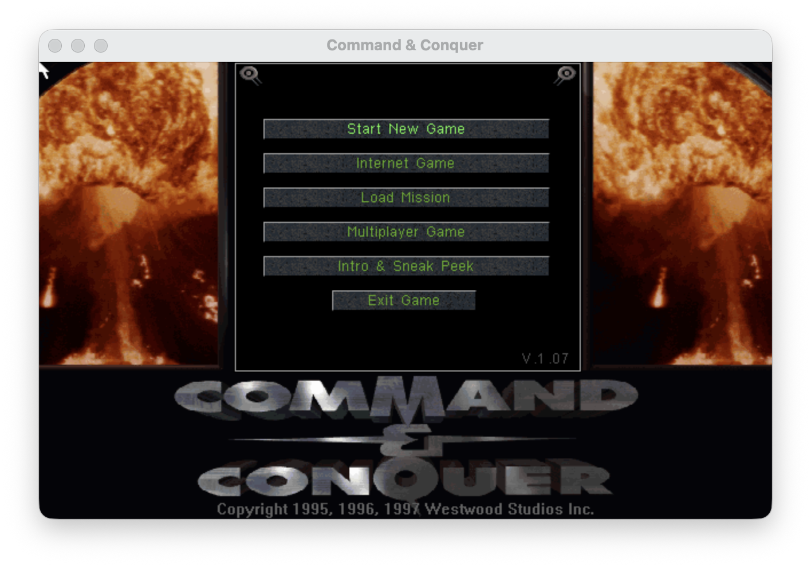

# cnc-port

**Native macOS, Android, and iOS source port of Command & Conquer: Tiberian Dawn.**

[](#quick-start)
[](#android-debug-apk)
[](#ios-debug-app)
[](#build-from-source)
[](#current-status)
[](#game-data)
[](#license-and-notice)

`cnc-port` lets you play Command & Conquer (1995) on a modern Mac. Android and iOS debug builds are available for local development and testing, with SDL2 providing the platform layer.



The repository contains source code and build tooling only. To run the game, download the freeware C&C Gold GDI and Nod data described below.

## Why This Exists

Command & Conquer was written for a very different desktop world. This project keeps the original source recognizable while making it run on modern macOS, Android, iPhone, and iPad.

It is an unofficial source port based on the source code Electronic Arts released under GPLv3 with additional terms: <https://github.com/electronicarts/CnC_Tiberian_Dawn>.

## Current Status

| Status | Feature | Notes |
| --- | --- | --- |
| :white_check_mark: | macOS on Apple Silicon | Builds and runs with CMake/Ninja. The title menu and tactical game have been exercised. |
| :white_check_mark: | Android debug APK | Builds a local landscape arm64-v8a APK. |
| :white_check_mark: | iOS debug app | Builds a landscape simulator app, which installs and launches. Signed device builds are supported. |
| :white_check_mark: | Core game presentation | Local C&C Gold data, movies, menus, rendering, keyboard, mouse, and touch input are wired up. |
| :construction: | Campaign and save/load validation | Later missions, saves, unusual menus, and physical mobile devices still need wider testing. |
| :x: | Release packages | No distributable macOS app, Android release APK, or iOS release build yet. |
| :x: | Online/network multiplayer | Not part of the current milestone. |

## Quick Start

Install the macOS build tools:

```sh
brew install cmake ninja pkg-config sdl2
xcode-select --install
```

Build the port:

```sh
cmake -S . -B build -G Ninja
cmake --build build --target cnc_mac -j 8
```

Prepare your local game data:

```sh
scripts/prepare_assets_from_local.sh \
  --gdi /path/to/gdi-disc \
  --nod /path/to/nod-disc
```

Run:

```sh
scripts/run_mac_dev.sh --no-build
```

To build and run the Android debug APK, follow the Android prerequisites below, keep the same prepared data under `assets/cnc`, then run:

```sh
scripts/build_android_debug.sh
scripts/run_android_debug.sh --no-build
```

To build and run the iOS simulator debug app, install full Xcode, keep the same prepared data under `assets/cnc`, then run:

```sh
scripts/build_ios_debug.sh
scripts/run_ios_simulator.sh --no-build
```

## Game Data

The repository does not contain game data, movies, music, disc images, archives, installers, or packaged executables.

### Freeware C&C Gold

Electronic Arts released the original Command & Conquer as freeware in 2007. The old EA download page is no longer live, but the community maintains current download pages. For this port, use the **Windows 95 C&C Gold** disc images:

- [GDI CD for Windows 95](https://cnc-comm.com/command-and-conquer/downloads/the-game/gdi-disc-win95)
- [Nod CD for Windows 95](https://cnc-comm.com/command-and-conquer/downloads/the-game/nod-disc-win95)
- [C&C Gold installer for modern Windows](https://cnc-comm.com/command-and-conquer/downloads/the-game/installer), if you want a ready-to-play Windows installation as well
- [CnCNet's download guide](https://cncnet.org/command-and-conquer/how-to-play), including its note on the official freeware release

Those downloads are hosted by community sites, not by this project or EA. Download the GDI and Nod archives, mount or extract the disc images, then give their disc-root paths to the asset preparation script.

The asset preparation script copies the C&C Gold GDI and Nod disc trees from paths that you provide:

- `assets/cnc/gdi`
- `assets/cnc/nod`

Each disc tree needs its original disc-root files plus the installed files from `INSTALL/SETUP.Z`, including `INSTALL/CONQUER.INI`, `CCLOCAL.MIX`, and `UPDATE.MIX`.

Those directories are ignored by Git. The Android and iOS debug builds use the same local tree and bundle it only into generated debug artifacts. Do not commit the assets or distribute debug packages that contain them.

## Build From Source

Configure and build:

```sh
cmake -S . -B build -G Ninja
cmake --build build --target cnc_mac -j 8
```

If Ninja is not installed, omit `-G Ninja` and CMake will use its default generator.

The build creates a normal macOS executable:

```text
build/cnc_mac
```

It is not packaged as a `.app` bundle yet.

## Run

The normal development command builds if needed, verifies the local data, signs the executable for local use, and launches it from the repository root:

```sh
scripts/run_mac_dev.sh
```

Useful variants:

```sh
scripts/run_mac_dev.sh --no-build
scripts/run_mac_dev.sh --prepare-only
```

Runtime files such as saves, options, screenshots, logs, and generated palette caches are ignored by Git.

## Android Debug APK

The Android target is for local development and testing. It builds an arm64-v8a landscape debug APK and copies the prepared local game data into the app on first launch.

Install Android tooling:

- JDK 17
- Gradle compatible with Android Gradle Plugin 9.2.0
- Android SDK Platform 36 and Build Tools
- Android NDK `28.2.13676358`
- Android CMake and platform-tools for `adb`

Android Studio is the easiest way to install the SDK, NDK, CMake, emulator, and platform-tools. On Homebrew-based macOS, the helper scripts detect common JDK and Android SDK locations when `JAVA_HOME`, `ANDROID_HOME`, and `ANDROID_SDK_ROOT` are not already set.

Build the debug APK:

```sh
scripts/build_android_debug.sh
```

The first build downloads SDL2 to ignored local storage under `android/third_party/`. The APK is written to:

```text
android/app/build/outputs/apk/debug/app-debug.apk
```

Install and launch on a connected device or emulator:

```sh
scripts/run_android_debug.sh --no-build
```

If an emulator needs a clean install, use:

```sh
scripts/run_android_debug.sh --no-build --fresh-install
```

`--fresh-install` removes existing app data, including extracted assets and saves. Add `--logcat` to tail the app log after launch.

The debug APK includes your local game data so it can run without external storage setup. Do not distribute it.

## iOS Debug App

The iOS target is also for local development and testing. It builds a landscape app for the simulator by default, or a signed arm64 device app when you provide an Apple development team.

Install:

- Full Xcode, not only Command Line Tools
- CMake
- Local C&C data prepared under `assets/cnc`

Build the simulator app:

```sh
scripts/build_ios_debug.sh --simulator
```

The first build downloads SDL2 to ignored local storage under `ios/third_party/`. The simulator app is written to:

```text
ios/build-simulator/Debug-iphonesimulator/cnc_ios.app
```

Install and launch it on a booted simulator:

```sh
scripts/run_ios_simulator.sh --no-build
```

Build a signed device app for iPhone or iPad:

```sh
CNC_IOS_DEVELOPMENT_TEAM=TEAMID scripts/build_ios_debug.sh --device
```

The debug iOS app copies bundled data into its writable sandbox so saves and options work normally. Do not distribute the generated app bundle.

## Fullscreen

Start fullscreen:

```sh
RA_FULLSCREEN=1 scripts/run_mac_dev.sh
```

Toggle fullscreen while running:

```text
Command+Return
```

## Tests

Run the source-level and script checks:

```sh
tests/run_script_tests.sh
```

Asset-backed keyframe decoding runs when `assets/cnc/gdi/CONQUER.MIX` is present. The test is skipped in a source-only checkout, so GitHub Actions does not require game data.

Validate a fresh macOS checkout with a full build first:

```sh
cmake -S . -B build -G Ninja
cmake --build build --target cnc_mac -j 8
tests/run_script_tests.sh
```

## Project Layout

| Path | Purpose |
| --- | --- |
| `CODE/` | Main Command & Conquer game code |
| `PORT/MAC/` | macOS runtime, compatibility shims, and SDL2 integration |
| `PORT/ANDROID/` | Android entrypoint and platform-specific setup |
| `PORT/IOS/` | iOS entrypoint and writable sandbox resource setup |
| `android/` | Gradle app that builds the debug APK |
| `ios/` | CMake/Xcode iOS app target |
| `WIN32LIB/`, `WINVQ/` | Legacy support libraries used by the port |
| `scripts/` | Asset preparation, build, run, and smoke-test helpers |
| `tests/` | Focused source-level and compatibility tests |
| `docs/images/` | README images only, not game data |

## Contributing

The port is intentionally conservative: keep the original source layout and behavior recognizable, and prefer small platform-specific support files over broad rewrites. Good next areas are campaign/save-load validation, physical device testing, macOS packaging, release-safe asset installation, and broader CI coverage.

Network and online multiplayer are out of scope for the current milestone.

## License And Notice

The source code is distributed under GPLv3 with additional terms. See [LICENSE.md](LICENSE.md).

This is an unofficial modified source port. It is not affiliated with, endorsed by, sponsored by, or supported by Electronic Arts or any other rights holder. See [NOTICE.md](NOTICE.md).
